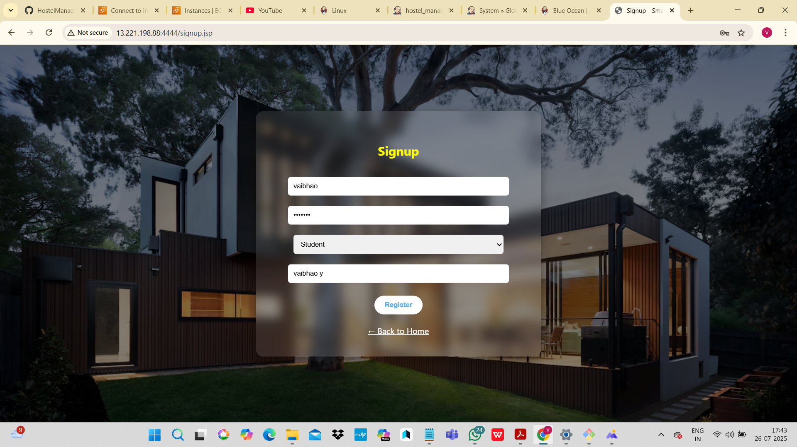

# 🏨 Hostel Management System

## 📌 Objective
The main objective of this project is to develop a **Hostel Management System** that automates hostel operations such as student admission, room allocation, fee collection, and record management.

---

## 📖 Introduction
The **Hostel Management System** is a web-based application that helps manage hostel-related activities efficiently.  
It allows administrators to manage student details, allocate rooms, handle fee payments, and generate reports in a simple and organized way.

---

## 🛠️ Technologies Used
- **Frontend:** JSP, HTML, CSS  
- **Backend:** Java, JDBC, Servlets  
- **Database:** MySQL  
- **Build Tool:** Maven  
- **Version Control:** Git & GitHub  

---

## ⚙️ Implementation Steps
1. Create database schema in **MySQL**.  
2. Develop **Java + JSP + Servlet** code for frontend and backend.  
3. Configure **pom.xml** for Maven dependencies.  
4. Deploy the `.war` file on **Apache Tomcat**.  
5. Test application using web browser (`http://localhost:8080/HostelManagement1`).  

---
## 📸 Screenshots

### 🏠 Welcome Page

### 📝 Signup Page

## 📂 Project Structure
